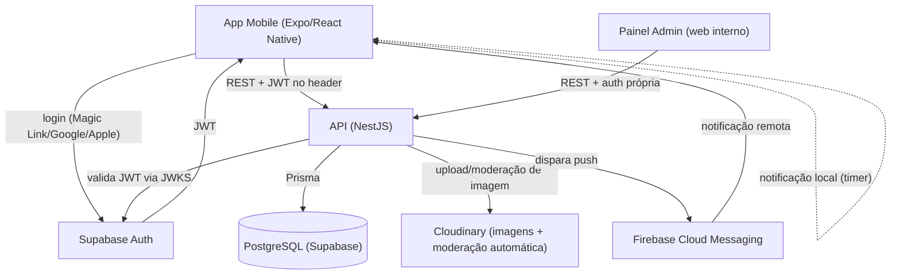

# TDD — Suliv MVP

| Campo | Valor |
|---|---|
| Tech Lead | Analira Scalabrini |
| Time | Pequeno/solo, sem prazo rígido definido |
| Documentos de origem | [01-marca.md](./01-marca.md), [02-prd.md](./02-prd.md) |
| Documento derivado | [04-data-contract-schema-spec.md](./04-data-contract-schema-spec.md) |
| Status | Draft |
| Criado em | 2026-07-11 |
| Última atualização | 2026-07-11 |

> Este documento cobre arquitetura, decisões técnicas, riscos e plano de implementação. Entidades de dados, schema de banco completo e contratos de API detalhados (request/response de cada endpoint) ficam no [04-data-contract-schema-spec.md](./04-data-contract-schema-spec.md) — aqui só o suficiente para embasar as decisões de arquitetura.

## 1. Contexto

O Suliv é um app mobile de receitas plant-based cujo diferencial é acompanhar a execução real da receita (guided cooking), não só a descoberta de conteúdo. O PRD ([02-prd.md](./02-prd.md)) já fechou a visão de produto, os 3 perfis de usuária, as regras de negócio (ranking, moderação, onboarding, offline) e as decisões não-funcionais de alto nível (seção 19.5).

O código-fonte anterior (apps/mobile, apps/web) foi removido de propósito — este é um projeto **greenfield**. Não há dívida técnica herdada para considerar, mas também não há nada reaproveitável.

**Domínio:** consumo de conteúdo (receitas), execução guiada (cozinha), e um fluxo de UGC moderado (receitas/comentários enviados por usuárias). Dado de alergia/restrição alimentar é dado de saúde sensível (LGPD).

## 2. Problema e motivação

- **App de receita genérico não resolve a dor real**: apps de receita atuais vivem na descoberta (feed, inspiração) e abandonam a usuária no momento em que ela mais precisa de ajuda — durante o preparo. O Suliv aposta que o guided cooking é o motor de retenção, não o feed.
- **Restrição alimentar hoje exige pesquisa manual e risco**: quem tem alergia/restrição não tem um jeito confiável de descobrir e adaptar receitas sem reler ingrediente por ingrediente.
- **Por que agora**: o PRD e todas as decisões de produto já estão fechados (ver seções 1-22 do 02-prd.md) — o projeto está pronto para sair do papel.
- **Impacto de não resolver tecnicamente bem**: se a arquitetura não suportar bem o ranking personalizado e a moderação desde o início, recalibrar pesos de score ou mudar o fluxo de moderação vira retrabalho caro depois que o catálogo e a base de usuárias já existirem.

## 3. Escopo

### 3.1 Dentro do escopo (este TDD)

- Arquitetura do backend (API), auth, banco de dados (alto nível), app mobile, painel admin de moderação.
- Estratégia de busca, ranking, paginação, offline sync, notificações, armazenamento de imagem.
- Segurança, observabilidade, testes, plano de rollback, plano de implementação por fases.

### 3.2 Fora do escopo (fica para o data-contract-schema-spec)

- Modelo de entidades completo (tabelas, colunas, tipos, constraints, índices).
- Contratos de API detalhados (request/response JSON de cada endpoint).
- Enums completos derivados das taxonomias já fechadas no PRD (categorias, alergênicos, unidades etc. — já estão listadas no PRD, só precisam virar schema).

### 3.3 Fora do escopo do MVP (herdado do PRD, seção 2.3/21)

- Web app (arquitetura já desenhada para suportar depois — ver seção 4.1).
- Receitas relacionadas, notificações de engajamento, upload manual de avatar, restauração persistente de guided cooking após matar o app.

## 4. Solução técnica

### 4.1 Stack e decisões de arquitetura

| Camada | Escolha | Racional |
|---|---|---|
| Mobile | React Native + Expo | Acelera build/CI/push/permissões; suporta prebuild se precisar de módulo nativo custom depois. |
| Backend/API | Node.js + NestJS (TypeScript) | Mesma linguagem do mobile; estrutura modular comporta a lógica de negócio custom (ranking, moderação, sync) sem espalhar regra de negócio em Edge Functions/RLS. |
| Auth | Supabase Auth (Magic Link + Google + Apple) | Resolve auth (a parte mais cara de construir certo, especialmente Apple Sign In) sem prender o resto do backend a um BaaS. NestJS valida o JWT do Supabase via JWKS — não usa o client SDK do Supabase para lógica de negócio. |
| Banco de dados | PostgreSQL gerenciado pelo Supabase | Single source of truth; acessado pelo NestJS via Prisma (não via client SDK do Supabase), mantendo a lógica de negócio isolada do provedor de auth. |
| ORM | Prisma | Melhor DX/type-safety para iteração rápida de schema no início do projeto. |
| Hospedagem da API | Plataforma gerenciada (Railway/Render/Fly.io) | Deploy rápido, sem operar infra própria no MVP; migração para AWS/GCP fica disponível se o volume justificar depois. |
| Armazenamento de imagem | Cloudinary | Resize/compress automático + moderação automática de conteúdo impróprio como primeiro filtro, antes da fila de moderação humana. |
| Push notification | Firebase Cloud Messaging (FCM) | Um único SDK cobre Android e iOS (via APNs por baixo). |
| Busca | Full-text search nativo do Postgres | Sem infra extra no MVP; troca por motor dedicado (Meilisearch/Elasticsearch) é evolução futura sem mudar o contrato de API. |
| Painel de moderação | App web interno separado (ex. Next.js), autenticação própria | Moderador não usa o mesmo login/app da usuária final (decisão do PRD, seção 14.5) — mantém a superfície de ataque do app de consumo limpa. |
| Feature flags | Tabela simples no banco + toggle no painel admin | Suficiente para rollout gradual no volume do MVP, sem custo de um serviço terceiro (ex. LaunchDarkly) ainda. |

### 4.2 Diagrama de arquitetura

**Nota importante de arquitetura (resolve ambiguidade do PRD seção 15.3):** notificação de "fim de timer" é **local**, agendada pelo próprio sistema operacional no momento em que a usuária inicia o timer no guided cooking — o backend não tem visibilidade sobre o estado de um timer client-side, então não pode disparar isso via push remoto. Já "receita aprovada" e "receita precisando de ajustes" são **push remoto via FCM**, disparadas pelo backend na ação do moderador.

### 4.3 Fluxo de dados — exemplos principais

1. **Login**: Mobile → Supabase Auth (Magic Link/Google/Apple) → JWT devolvido ao app → toda chamada subsequente à API leva o JWT no header → NestJS valida via JWKS do Supabase e resolve o usuário.
2. **Primeiro acesso**: após login, API cria o registro de usuário/perfil no Postgres (nickname genérico gerado automaticamente, ver PRD 5.3) e sinaliza `onboarding_completed: false`.
3. **Feed**: Mobile → `GET /feed` (com filtros de preferência aplicados por padrão) → API monta os 3 blocos (Selecionadas para você, Categorias, Top da semana) com paginação cursor-based, calculando o score em tempo real na query (ver 4.5).
4. **Envio de receita**: Mobile → upload de imagem direto pro Cloudinary (moderação automática de conteúdo) → Mobile → `POST /recipes` com a URL da imagem já processada → API cria receita com status `em_analise` → notifica fila do painel admin.
5. **Moderação**: Moderador (painel admin) → aprova/devolve via API própria do painel → API atualiza status da receita → dispara push via FCM para a autora.
6. **Offline → sync**: ações de favoritar/rascunho feitas offline entram numa fila local no app → ao reconectar, Mobile → `POST /sync` (lote, com chave de idempotência por ação) → API aplica as ações sem duplicar.
7. **Compartilhar receita**: deep link público com slug estável (`suliv.app/r/<slug>`) resolve para uma rota pública da API que retorna os dados da receita, mesmo sem autenticação — usada tanto para abrir no app quanto para preview fora dele.

### 4.4 Módulos do backend (NestJS)

Auth (guard de validação de JWT), Users/Profile, Preferences (onboarding), Recipes (catálogo + submissão), Categories/Allergens (taxonomias de referência), Search, Ranking, Favorites, Comments/Ratings, Reports, Moderation, Notifications, Sync (offline), Analytics (ingestão de eventos), FeatureFlags.

O detalhamento de entidades/tabelas por módulo fica no data-contract-schema-spec.

**Comportamento client-side (app mobile) relacionado à Sync:** rascunho de receita com imagem não tem limite de tempo para permanecer só local, mas o app exibe aviso soft se o rascunho passar de 7 dias sem sincronizar com a API — mesmo padrão de aviso soft já usado para o limite de 10 rascunhos simultâneos (PRD 14.3).

### 4.5 Cálculo de score (ranking)

Calculado **em tempo real, por request**, sem pré-computação/cache — decisão consciente para o volume do MVP: mais simples de implementar, sempre reflete o estado atual (sem lag), e evita a complexidade de infra de job/fila que um modelo pré-computado exigiria. Se o volume de receitas/usuárias crescer a ponto de essa query pesar no SLA de performance (seção 6.4), a evolução natural é pré-computar e cachear — os pesos e a fórmula (PRD seção 9.2) não mudam, só a estratégia de execução.

A query de "Selecionadas para você" combina duas condições: (a) 1 posição sempre reservada para conteúdo recente compatível (cold start, PRD 9.4), e (b) as demais posições exigem o piso de elegibilidade de **10 aberturas OU 3 conclusões de guided cooking** (PRD 9.5) antes de entrar no ranking por score.

**Precisão sobre "tempo real":** o *score* é calculado por request, mas os *sinais de popularidade* que o alimentam (aberturas, favoritos, conclusões — fórmula no PRD 9.6) vêm de uma tabela de agregação diária (`recipe_daily_stats`, ver data-contract-schema-spec 3.18), incrementada nas próprias ações da API — a query de feed nunca varre a tabela crua de eventos de analytics.

### 4.6 Paginação

Todas as listas com scroll infinito (feed, busca, ver tudo) usam **cursor-based pagination** — mais estável que offset-based quando o conteúdo muda entre páginas (novo item entrando no meio do feed), e mais barato de manter conforme o catálogo cresce.

## 5. Riscos

| Risco | Impacto | Probabilidade | Mitigação |
|---|---|---|---|
| Configuração incorreta da validação de JWT do Supabase permite bypass de autenticação | Alto | Baixa | Usar biblioteca madura de validação via JWKS, cobrir com teste de integração que tenta acessar rota protegida sem token válido/expirado. |
| Cálculo de score em tempo real degrada performance conforme catálogo cresce | Médio | Média | Índices nas colunas usadas no score, monitorar p95 (seção 6.4), evoluir para pré-computado se o SLA for violado — mudança aditiva, não destrutiva. |
| Dado de alergia/restrição (saúde sensível, LGPD) tratado sem cuidado adequado | Alto | Baixa | Acesso restrito por role, anonimização na exclusão de conta (PRD 5.6) já definida, encriptação at-rest padrão do Postgres gerenciado. |
| Moderação automática de imagem (Cloudinary) deixa passar conteúdo impróprio | Médio | Média | Moderação automática é só o primeiro filtro — aprovação humana continua sendo o gate obrigatório antes de publicar (PRD 14.5). |
| Escopo grande demais para time pequeno/solo sem prazo fixo | Alto | Alta | Plano de implementação em fases (seção 8) prioriza o "loop núcleo" (auth → onboarding → feed → guided cooking) antes de moderação/social — MVP utilizável antes de todo o escopo do PRD estar pronto. |
| Conflito de sincronização offline (favoritos/rascunho editado em mais de um dispositivo) causa perda de dado | Médio | Baixa | MVP assume last-write-wins simples com chave de idempotência por ação — documentado como simplificação consciente, não como lacuna esquecida. |
| Dependência do Supabase para Auth — indisponibilidade do Supabase bloqueia login mesmo com a API no ar | Médio | Baixa | Risco aceito para o MVP; o acoplamento é isolado ao módulo de Auth, então trocar de provedor no futuro não exige reescrever o resto do backend. |

## 6. Considerações de segurança

- **Autenticação**: JWT emitido pelo Supabase Auth, validado pela API via JWKS em cada request. Sem sessão própria no backend além da validação de token.
- **Autorização**: usuária final só acessa/edita os próprios dados (perfil, favoritos, rascunhos). Moderador/admin usa role própria em painel separado, sem acesso via app de usuária final.
- **Dados sensíveis (LGPD)**: alergia/restrição alimentar é tratada como dado de saúde. Acesso restrito por role no backend; anonimização de dados pessoais na exclusão de conta (PRD 5.6); aceite de termos versionado (PRD 5.7).
- **Validação de entrada**: DTOs validados em toda rota de escrita (NestJS `ValidationPipe`), evitando injeção e payload malformado.
- **Upload de imagem**: só aceito via Cloudinary (nunca upload direto pro storage próprio), com moderação automática de conteúdo antes da fila de revisão humana.
- **Rate limiting** (PRD 19.5.8): 5 receitas/dia, 20 comentários/avaliações/dia, 10 denúncias/dia, por usuária.
- **Auditoria**: boost editorial exige autoria e data de aplicação registradas (PRD 14.8); ações de moderação (aprovação, devolução, exclusão) ficam com log de quem/quando.

## 7. Estratégia de testes

| Tipo | Escopo | Ferramenta |
|---|---|---|
| Unitário | Services do NestJS (regras de score, recálculo de porção, validação de username) | Jest |
| Integração | Endpoints da API + banco de teste | Jest + Supertest |
| E2E mobile | Fluxos críticos: login, onboarding, favoritar offline→sync, guided cooking completo | Maestro (ou Detox) |
| Contrato | Nada de externo é crítico o suficiente para contrato formal no MVP — Cloudinary/FCM/Supabase são mockados em teste | — |

**Cenários críticos que precisam de teste explícito:**
- Score de ranking aplica a penalidade correta em conflito de alergia sem excluir a receita (soft filter).
- Recálculo de porção respeita ingredientes marcados como não-escaláveis.
- Fila de sync offline aplica ações sem duplicar em reconexão (idempotência).
- Timer local dispara mesmo com app em background; avançar passo com timer ativo exige confirmação.
- Receita não aprovada não aparece em busca/feed/deep link público para ninguém além de autora e moderador.

## 8. Plano de implementação (por fases, sem data fixa)

| Fase | Entrega | Depende de |
|---|---|---|
| 0 — Fundação | Repo, CI/CD básico, envs (dev/staging/prod), projeto Supabase (Auth configurado), schema inicial no Prisma, guard de JWT no NestJS | — |
| 1 — Conta e onboarding | Criação de perfil no primeiro acesso, username com cooldown, preferências (dieta/alergia/nível/frequência), aceite de termos versionado | Fase 0 |
| 2 — Catálogo e descoberta | Schema de receita + seed, categorias/alergênicos de referência, busca full-text, filtros, feed com os 3 blocos, score em tempo real, paginação cursor | Fase 1 |
| 3 — Receita detalhe e favoritos | Endpoint de detalhe, recálculo de porção, faixa de alerta, favoritos + fila offline/sync | Fase 2 |
| 4 — Guided cooking | Passos/timer, notificação local, eventos de analytics, tela de finalização, deep link de compartilhamento | Fase 3 |
| 5 — Minhas receitas e moderação | Formulário de envio + rascunho, upload Cloudinary, painel admin (app separado), fluxo de status e versionamento | Fase 2 |
| 6 — Comentários e avaliações | Rating + comentário, denúncia (mesmo mecanismo de moderação) | Fase 5 |
| 7 — Notificações remotas | Registro de device token, push de receita aprovada/ajustes via FCM | Fase 5 |
| 8 — Estados e polimento | 8 estados de erro/empty state do PRD (seção 17), acessibilidade básica, ajuste de performance contra o SLA | Fases 1-7 |
| 9 — QA e lançamento interno | Testes E2E completos, rollout gradual via feature flag, checklist de critérios de aceite (PRD seção 20) | Fase 8 |

**Loop núcleo (fases 0-4)** é o que prova a proposta de valor (guided cooking) e deveria ser priorizado como o primeiro marco utilizável, mesmo antes de moderação/social estarem prontos.

## 9. Monitoramento e observabilidade

- **Métricas técnicas**: latência de feed/busca (meta p95 < 500ms, PRD 19.5.7), taxa de erro da API, saúde das dependências externas (Supabase Auth, Cloudinary, FCM).
- **Métrica de produto (norte)**: funil `guided_cook_started` → `guided_cook_finished` (PRD seção 18) — deveria ter um dashboard dedicado, é o indicador de que o MVP está funcionando.
- **Logs estruturados**: toda ação de moderação, toda falha de sync offline, toda rejeição de auth.
- **Alertas mínimos no MVP**: taxa de erro da API acima de um limiar, indisponibilidade do Supabase Auth ou Cloudinary.

## 10. Plano de rollback

- **Deploy**: feature flags (tabela própria, seção 4.1) permitem ligar/desligar mudanças de ranking, onboarding ou moderação sem novo deploy.
- **Gatilho de rollback**: taxa de erro elevada ou queda de performance após deploy em produção.
- **Passos**: desativar feature flag relevante → reverter deploy para versão anterior na plataforma de hospedagem → se houve migration de schema, aplicar down migration do Prisma (testada em staging antes de qualquer deploy em produção).
- **Ambientes**: staging replica produção antes de qualquer release ir ao ar (PRD 19.5.6).

## 11. Métricas de sucesso

Reaproveitadas do PRD (seção 2.2/18.2), sem redefinição aqui: uso do guided cooking (norte), receitas enviadas, porções recalculadas, abertura de receita por origem (feed/busca), favoritos salvos.

## 12. Dependências

| Dependência | Tipo | Risco |
|---|---|---|
| Supabase Auth | Externa | Baixo — isolado ao módulo de Auth |
| Cloudinary | Externa | Baixo — moderação automática é filtro, não gate único |
| FCM | Externa | Baixo — notificação de timer é local, não depende disso |
| Plataforma de hospedagem (Railway/Render/Fly.io) | Infraestrutura | Baixo no volume do MVP |

## 13. Open questions (técnicas, além das já listadas no PRD seção 22)

- Biblioteca específica de validação de JWT/JWKS a adotar no NestJS (decisão de implementação, não bloqueia a arquitetura).
- Ferramenta exata de E2E mobile (Maestro vs Detox) — recomendação é Maestro por simplicidade de setup, mas não é bloqueante para o restante do TDD.
