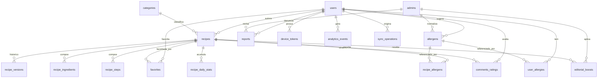

# Data Contract & Schema Spec — Suliv MVP

> Detalha o que o [03-tdd.md](./03-tdd.md) deixou em alto nível: entidades, tipos, enums fechados (herdados do [02-prd.md](./02-prd.md)), relacionamentos e contratos de API por módulo. Fonte de verdade para o schema Prisma e para os DTOs do NestJS.

## 1. Convenções gerais

- Todo `id` é UUID v4, exceto onde indicado.
- Toda tabela tem `created_at`/`updated_at` (timestamptz), omitidos abaixo quando óbvio.
- Enums são implementados como `enum` do Postgres (via Prisma), não como string livre — validação de taxonomia fechada acontece no banco, não só na aplicação.
- Toda resposta de listagem paginada usa cursor: `{ items: T[], nextCursor: string | null }`.
- Toda rota autenticada exige header `Authorization: Bearer <jwt supabase>`, validado pela API via JWKS.
- Rotas do painel admin (`/admin/*`) usam autenticação própria (tabela `admins`, não `users`) — nunca aceitam o JWT de usuária final.

## 2. Enums fechados (herdados do PRD)

```
DietPreference:      vegano | vegetariano | flexitariano
CookingLevel:         iniciante | intermediario | avancado   (mesmo enum usado para dificuldade de receita)
CookingFrequency:     raramente | algumas_vezes_semana | quase_todo_dia
RecipeCategory:       cafe_da_manha | almoco_jantar | lanche | sobremesa | bebida | molhos_acompanhamentos
TimeBucket:           ate_15 | quinze_30 | trinta_60 | sessenta_mais
IngredientUnit:       g | kg | ml | l | unidade | xicara | colher_sopa | colher_cha | pitada | a_gosto
RecipeStatus:         rascunho | em_analise | aprovada | precisa_de_ajustes | removida
AdjustmentReason:     ingrediente_ambiguo | passo_confuso | falta_foto | foto_baixa_qualidade |
                       tempo_porcao_incoerente | conteudo_inadequado | outro
ReportReason:         conteudo_inadequado | spam | informacao_incorreta_perigosa |
                       discurso_odio_assedio | outro
ReportTargetType:     recipe | comment
ReportStatus:         pending | reviewed
CommentStatus:        visible | hidden
AllergenStatus:       approved | pending
AccountStatus:        active | anonymized
AdminRole:             moderator | admin
DevicePlatform:       ios | android
```

`removida` em `RecipeStatus` é o soft delete da exclusão pela autora (PRD 14.5): a linha permanece no banco (histórico de moderação, FKs e deep links caem na tela "receita não disponível" do PRD 17), mas a receita some de feed, busca, favoritos de terceiras (filtrados silenciosamente) e listas.

**Compatibilidade de dieta (usada no sinal +40 do score e no selo):** hierarquia vegano ⊂ vegetariano ⊂ flexitariano — receita vegana é compatível com os 3 perfis; vegetariana é compatível com vegetariano e flexitariano; flexitariana só com flexitariano.

`Allergen` não é enum fixo no schema — é tabela de referência (`allergens`), porque cresce via `pending_normalization` (PRD 7.3). Os 7 valores iniciais aprovados (Peixes e Crustáceos/Moluscos ficam de fora — catálogo 100% plant-based, nunca gerariam conflito real; reativar é só mudar `status`, sem migration): Leite, Ovos, Trigo (Glúten), Amendoim, Castanhas e Nozes, Soja, Gergelim.

## 3. Entidades

### 3.1 `users`

Espelha `auth.users` do Supabase por `id` (mesma PK), mas guarda os dados de produto que o Supabase Auth não tem.

| Campo | Tipo | Notas |
|---|---|---|
| id | uuid (PK) | = `auth.users.id` do Supabase |
| email | text | somente leitura, vem do Supabase (não editável — PRD 5.4) |
| name | text | |
| username | text, unique | 3–20 chars, `[a-zA-Z0-9_.]`, filtro de profanidade na escrita |
| username_updated_at | timestamptz, nullable | usado para cooldown de 30 dias |
| avatar_url | text, nullable | reutiliza foto do provedor social; sem upload manual no MVP |
| diet_preference | DietPreference, nullable | preenchido no onboarding |
| cooking_level | CookingLevel, nullable | preenchido no onboarding |
| cooking_frequency | CookingFrequency, nullable | preenchido no onboarding |
| onboarding_completed_at | timestamptz, nullable | |
| terms_version_accepted | text, nullable | versão do termo aceito |
| terms_accepted_at | timestamptz, nullable | |
| status | AccountStatus | default `active`; `anonymized` após exclusão de conta (LGPD) |

**Regra de anonimização (PRD 5.6):** ao excluir conta:

- `name`/`email`/`avatar_url` são zerados e `username` vira algo tipo `usuaria-removida-<hash>`; `status = anonymized`
- `user_allergies` é **deletada** (dado de saúde sensível — LGPD exige remoção, não só desvinculação)
- `device_tokens` é deletada (nenhum push após exclusão)
- `analytics_events.user_id` é anulado nos eventos históricos da conta
- o registro correspondente em `auth.users` do Supabase é deletado (o email também vive lá, não só em `users`)
- receitas de autoria permanecem (`recipes.author_id` aponta pro `users.id` anonimizado, exibido como "usuária removida"); comentários/avaliações seguem a mesma regra (permanecem com autoria anonimizada)

### 3.2 `user_allergies`

Join table `users` ↔ `allergens`.

| Campo | Tipo |
|---|---|
| user_id | uuid (FK users) |
| allergen_id | uuid (FK allergens) |

PK composta `(user_id, allergen_id)`.

### 3.3 `allergens`

| Campo | Tipo | Notas |
|---|---|---|
| id | uuid (PK) | |
| name | text, unique | |
| status | AllergenStatus | `approved` (os 7 iniciais) ou `pending` |
| suggested_by_user_id | uuid, nullable (FK users) | quem sugeriu o termo livre |
| reviewed_by_admin_id | uuid, nullable (FK admins) | quem normalizou |

Só termos `approved` entram no autocomplete e contam como sinal confiável de conflito no score (PRD 9.2/7.3).

### 3.4 `categories`

| Campo | Tipo |
|---|---|
| id | uuid (PK) |
| key | RecipeCategory, unique |
| label | text |

Tabela de referência simples — poderia ser só o enum `RecipeCategory`, mas fica como tabela para permitir metadado futuro (ícone, ordem de exibição) sem migration de enum.

### 3.5 `recipes`

| Campo | Tipo | Notas |
|---|---|---|
| id | uuid (PK) | identidade estável — é o que `favorites`/`comments` referenciam (PRD 14.5: favorito aponta pro card lógico, não pra versão) |
| slug | text, unique | usado no deep link público (`suliv.app/r/<slug>`) |
| author_id | uuid, nullable (FK users) | nullable pra sobreviver à anonimização de conta |
| title | text | |
| description | text | |
| cover_image_url | text, nullable | obrigatório para envio, opcional para rascunho (PRD 14.3) |
| category_id | uuid (FK categories) | |
| prep_time_minutes | int | |
| time_bucket | TimeBucket | derivado de `prep_time_minutes` na escrita, usado como filtro indexado |
| servings | int | sempre "pessoas" (PRD 10.2) |
| difficulty | CookingLevel | definida pela autora, moderador pode corrigir |
| diet_preference | DietPreference | |
| status | RecipeStatus | default `rascunho` |
| current_version | int | default 1; incrementa a cada edição pós-aprovação (PRD 14.4) |
| adjustment_reason | AdjustmentReason, nullable | preenchido quando `status = precisa_de_ajustes` |
| adjustment_note | text, nullable | texto livre opcional complementar |
| author_message_to_moderator | text, nullable | |
| terms_version_accepted | text, nullable | aceite específico do envio de receita (PRD 14.2) |
| submitted_at | timestamptz, nullable | |
| approved_at | timestamptz, nullable | |
| removed_at | timestamptz, nullable | preenchido no soft delete (`status = removida`) |

Índices: `(status)`, `(category_id, status)`, `(time_bucket, status)`, `(diet_preference, status)`, full-text em `(title, description)` **e em `recipe_ingredients.name`** (a busca cobre título + categoria + ingredientes — PRD 19.5.1; a busca por ingrediente é feita via join ou coluna `tsvector` agregada na receita, atualizada na escrita).

**Slug é imutável após a aprovação** — editar o título em versões futuras não muda o slug, para que deep links compartilhados nunca quebrem.

### 3.6 `recipe_versions`

Histórico/auditoria — não é referenciado por `favorites` nem `comments` (decisão PRD 14.4/14.5: usuária sempre vê a versão mais recente aprovada).

| Campo | Tipo |
|---|---|
| id | uuid (PK) |
| recipe_id | uuid (FK recipes) |
| version_number | int |
| snapshot | jsonb | cópia integral de título/ingredientes/passos/porções naquele momento |
| created_at | timestamptz |

Unique `(recipe_id, version_number)`.

### 3.7 `recipe_ingredients`

| Campo | Tipo | Notas |
|---|---|---|
| id | uuid (PK) | |
| recipe_id | uuid (FK recipes) | |
| name | text | |
| quantity | numeric, nullable | nulo quando `unit = a_gosto` |
| unit | IngredientUnit | |
| scales_with_servings | boolean | default `true`; `false` para itens tipo sal/pimenta/louro (PRD 10.2) — `pitada`/`a_gosto` nascem `false` |
| allergen_id | uuid, nullable (FK allergens) | tag opcional pra alimentar `recipe_allergens` automaticamente quando aplicável |
| order | int | |

Unique `(recipe_id, order)`.

### 3.8 `recipe_steps`

| Campo | Tipo | Notas |
|---|---|---|
| id | uuid (PK) | |
| recipe_id | uuid (FK recipes) | |
| order | int | |
| description | text | |
| step_time_seconds | int, nullable | alimenta o timer do guided cooking (PRD 11.2) |

Unique `(recipe_id, order)`.

### 3.9 `recipe_allergens`

Tabela derivada — conflitos conhecidos entre a receita e os alergênicos fechados, usada pra faixa de alerta e pra penalidade de score (PRD 9.2, −80).

| Campo | Tipo |
|---|---|
| recipe_id | uuid (FK recipes) |
| allergen_id | uuid (FK allergens, status=approved) |

PK composta `(recipe_id, allergen_id)`. Populada a partir de `recipe_ingredients.allergen_id` na escrita/edição da receita.

### 3.10 `favorites`

| Campo | Tipo | Notas |
|---|---|---|
| id | uuid (PK) | |
| user_id | uuid (FK users) | |
| recipe_id | uuid (FK recipes) | aponta pro card lógico (PRD 14.5) |

Unique `(user_id, recipe_id)`. Idempotência de ações vindas da fila offline é registrada em `sync_operations` (3.18), não aqui. Receitas com `status = removida` são filtradas silenciosamente da listagem de favoritos (PRD 14.5).

### 3.11 `comments_ratings`

| Campo | Tipo | Notas |
|---|---|---|
| id | uuid (PK) | |
| recipe_id | uuid (FK recipes) | |
| user_id | uuid (FK users) | |
| rating | int (1–5) | obrigatório (PRD 14.6) |
| comment_text | text, nullable | opcional |
| status | CommentStatus | `hidden` após moderação por denúncia procedente |

Unique `(user_id, recipe_id)` — **1 avaliação por usuária por receita, editável**: avaliar de novo atualiza a linha existente (rating, texto e `updated_at`), nunca cria uma segunda. Rating **não** entra no cálculo de score (PRD 9.3) — só é exibido/agregado na tela de receita.

### 3.12 `reports`

Único mecanismo de denúncia pra receita e comentário/avaliação (PRD 14.7).

| Campo | Tipo |
|---|---|
| id | uuid (PK) |
| reporter_user_id | uuid (FK users) |
| target_type | ReportTargetType |
| target_id | uuid | aponta pra `recipes.id` ou `comments_ratings.id` conforme `target_type` |
| reason | ReportReason |
| free_text | text, nullable |
| status | ReportStatus |
| reviewed_by_admin_id | uuid, nullable (FK admins) |

Unique `(reporter_user_id, target_type, target_id)` — a mesma usuária não denuncia o mesmo conteúdo duas vezes. Denúncia procedente em `recipes` reabre o item para `status = em_analise` (PRD 14.5).

### 3.13 `editorial_boosts`

| Campo | Tipo | Notas |
|---|---|---|
| id | uuid (PK) | |
| recipe_id | uuid (FK recipes) | |
| weight | int | soma ao score (PRD 9.2, `+X`) |
| applied_by_admin_id | uuid (FK admins) | |
| starts_at | timestamptz | obrigatório (PRD 14.8) |
| ends_at | timestamptz | obrigatório — sem boost permanente |

### 3.14 `device_tokens`

| Campo | Tipo |
|---|---|
| id | uuid (PK) |
| user_id | uuid (FK users) |
| token | text, unique |
| platform | DevicePlatform |

### 3.15 `analytics_events`

| Campo | Tipo | Notas |
|---|---|---|
| id | uuid (PK) | |
| user_id | uuid, nullable (FK users) | nullable pra evento pré-login (ex. `splash_loaded`) |
| session_id | text | contexto padrão em todo evento (PRD 18.1.1) |
| platform | DevicePlatform | contexto padrão |
| app_version | text | contexto padrão |
| event_name | text | um dos nomes fechados no PRD 18.1 |
| properties | jsonb | payload específico do evento — tabela completa por evento no PRD, seção 18.1.2 |
| occurred_at | timestamptz | timestamp de origem no client, pode diferir de `created_at` (ingestão) |

Índice recomendado: `(event_name, occurred_at)` para consultas de funil (ex. `guided_cook_started` → `guided_cook_finished`).

### 3.16 `feature_flags`

| Campo | Tipo |
|---|---|
| id | uuid (PK) |
| key | text, unique |
| enabled | boolean |
| rollout_percentage | int, nullable |

### 3.17 `admins`

Tabela separada de `users` — moderador/admin nunca é uma linha em `users` (PRD 14.5, painel separado).

| Campo | Tipo |
|---|---|
| id | uuid (PK) |
| email | text, unique |
| role | AdminRole |

Autenticação do painel admin é um mecanismo à parte do Supabase Auth do app (a definir na implementação — ex. Supabase Auth em projeto/app separado, ou auth própria simples dado o volume baixo de moderadores).

### 3.18 `recipe_daily_stats`

Agregado diário por receita — fonte dos sinais de popularidade. Incrementado pela API nas próprias ações (abertura via `GET /recipes/:slug`, favorito via `POST /favorites`) e na ingestão de eventos (`guided_cook_finished`). Evita que a query de feed/ranking varra `analytics_events` cru.

| Campo | Tipo | Notas |
|---|---|---|
| recipe_id | uuid (FK recipes) | |
| date | date | |
| opens | int | default 0 |
| favorites_added | int | default 0 |
| cook_completions | int | default 0 |

PK composta `(recipe_id, date)`.

**Fórmula de popularidade (PRD 9.6):** `popularidade = opens + 2×favorites_added + 3×cook_completions`, somados na janela rolling dos últimos 7 dias. Usada em: Top da semana, piso de elegibilidade de "Selecionadas para você" (10 aberturas OU 3 conclusões — PRD 9.5), sinal "+15 populares da semana" e "+10 categoria com bom desempenho" (média de popularidade das receitas da categoria). Pesos são hipótese inicial a calibrar, como os do score.

### 3.19 `sync_operations`

Registro de idempotência da fila de sincronização offline (seção 6) — cobre todos os tipos de ação (`favorite_add`, `favorite_remove`, `draft_upsert`) num único mecanismo.

| Campo | Tipo | Notas |
|---|---|---|
| id | uuid (PK) | |
| user_id | uuid (FK users) | |
| idempotency_key | text | gerada no client, única por ação |
| action_type | text | `favorite_add` \| `favorite_remove` \| `draft_upsert` |
| applied_at | timestamptz | |

Unique `(user_id, idempotency_key)`.

## 4. Diagrama de relacionamentos



## 5. Contratos de API por módulo

Formato: `MÉTODO /rota` — descrição — request (campos principais) → response (forma, não schema completo).

### 5.1 Perfil (`/me`)

- `POST /me/bootstrap` — `{ name? }` (JWT no header, sem body obrigatório) → cria a linha em `public.users` no primeiro acesso, espelhando o `id` do `auth.users` do Supabase (upsert idempotente — chamadas repetidas para o mesmo `id` não duplicam nem sobrescrevem dados já preenchidos). Resposta `201` `{ user, missingName: boolean }` — `missingName` cobre o caso do login social sem nome (PRD 4.2), sinalizando o app a mostrar a tela de completar dados antes do onboarding.
- `GET /me` → perfil completo (dados de 3.1 + preferências)
- `PATCH /me` — `{ name?, diet_preference?, cooking_level?, cooking_frequency?, username? }` → perfil atualizado. `name` cobre o fluxo de completar dados que faltaram do login social (PRD 4.2). Se `username` já existir: `409` com mensagem de erro simples (sem sugestão automática — PRD 5.3). Se `username` alterado antes de 30 dias do último update: `422` (cooldown ativo).
- `PATCH /me/allergies` — `{ allergen_ids: string[], new_term?: string }` → lista atualizada; `new_term` cria linha `pending` em `allergens`
- `POST /me/onboarding` — `{ diet_preference, allergen_ids, new_terms?, cooking_level, cooking_frequency }` → conclusão atômica do onboarding: grava as preferências, cria alergias e seta `onboarding_completed_at` numa única chamada (evita estado parcial se a usuária fechar o app no meio)
- `POST /me/terms-acceptance` — `{ terms_version: string }` → `terms_version_accepted`, `terms_accepted_at` atualizados
- `GET /me/recipes?status=&cursor=` → "Minhas receitas" (PRD 13.5): lista das receitas da própria usuária com status (`rascunho`, `em_analise`, `aprovada`, `precisa_de_ajustes`), paginada
- `DELETE /me` → inicia anonimização (PRD 5.6), `202 Accepted`

### 5.2 Catálogo e descoberta

- `GET /feed?cursor=` → `{ selectedForYou: Recipe[5], categories: {category, recipes}[], topOfWeek: {items, nextCursor} }`
- `GET /recipes/search?q=&category=&time=&difficulty=&diet=&allergens=&cursor=` → lista paginada por cursor, ordenação padrão = mesma lógica de "ver tudo" da origem (PRD 8.5)
- `GET /categories` → lista fechada (3.4)
- `GET /allergens?status=approved` → lista para autocomplete do onboarding/filtro

### 5.3 Receita

- `GET /recipes/:slug` — **rota pública** (única do app sem JWT obrigatório): resolve o deep link `suliv.app/r/<slug>` mesmo sem conta (PRD 11.5). Autenticada, adiciona faixa de alerta personalizada e estado de favorito; anônima, retorna só o conteúdo. Detalhe completo: cabeçalho, ingredientes com regra de escala, passos, comentários/avaliações. Visibilidade: receita não aprovada só é retornada para a própria autora (JWT) ou via painel admin — para qualquer outra pessoa responde `404`; `status = removida` responde `404` (tela "receita não disponível", PRD 17). Incrementa `recipe_daily_stats.opens`.
- `GET /recipes/:slug?servings=<n>` → mesma resposta, com `recipe_ingredients` recalculados conforme `scales_with_servings`
- `POST /recipes` — cria `rascunho`, campos de 3.5 (imagem opcional)
- `PATCH /recipes/:id` — edita rascunho ou receita aprovada (gera nova `recipe_versions` se já aprovada — PRD 14.4; slug não muda)
- `POST /recipes/:id/submit` — envia para moderação (`status → em_analise`); exige imagem e `terms_version_accepted`. Rate limit: 5/dia por usuária.
- `DELETE /recipes/:id` — exclusão pela autora = **soft delete** (`status → removida`, `removed_at` preenchido); some de feed/busca/favoritos de terceiras silenciosamente, deep links caem em "não disponível". Se `favorites` > 0, response prévio de confirmação com contagem de impacto (PRD 14.5) via `DELETE /recipes/:id?confirm=false` retornando `{ favoritesCount }`, e `confirm=true` efetivando

### 5.4 Favoritos e sync

- `GET /favorites?cursor=` → lista paginada (receitas `removida` filtradas)
- `POST /favorites` — `{ recipe_id, idempotency_key? }` — incrementa `recipe_daily_stats.favorites_added`
- `DELETE /favorites/:recipe_id`
- `POST /sync` — `{ actions: [{ type: 'favorite_add'|'favorite_remove'|'draft_upsert', payload, idempotency_key }] }` → aplica em lote, ignora `idempotency_key` já processada (ver seção 6)

### 5.5 Comentários e avaliações

- `GET /recipes/:id/comments?cursor=`
- `POST /recipes/:id/comments` — `{ rating: 1-5, comment_text? }`. Rate limit: 20/dia por usuária.
- `DELETE /comments/:id` — só autora do comentário

### 5.6 Denúncias

- `POST /reports` — `{ target_type, target_id, reason, free_text? }`. Rate limit: 10/dia por usuária.

### 5.7 Notificações

- `POST /me/device-tokens` — `{ token, platform }`
- `DELETE /me/device-tokens/:token`

### 5.8 Analytics

- `POST /events` — `{ context: { session_id, platform, app_version }, events: [{ event_name, properties, occurred_at }] }` — ingestão em lote a partir do client; o `context` (envelope) preenche as colunas de contexto padrão (PRD 18.1.1) de todos os eventos do lote. Ingestão de `guided_cook_finished` incrementa `recipe_daily_stats.cook_completions`.

### 5.8b Configuração do app

- `GET /terms/current` — **pública** → `{ version, url }` da versão vigente dos termos (o app compara com `terms_version_accepted` para decidir se pede re-aceite — PRD 5.7)
- `GET /feature-flags` — autenticada → `{ [key]: boolean }` já avaliado para a usuária (rollout percentual resolvido no servidor)

### 5.9 Painel admin (`/admin/*`, auth própria)

- `GET /admin/recipes?status=em_analise&cursor=`
- `POST /admin/recipes/:id/approve`
- `POST /admin/recipes/:id/request-adjustment` — `{ reason: AdjustmentReason, note? }`
- `GET /admin/reports?status=pending`
- `POST /admin/reports/:id/resolve` — `{ action: 'dismiss'|'hide_content'|'reopen_recipe' }`
- `POST /admin/allergens/:id/approve` — normaliza termo pendente (PRD 7.3)
- `POST /admin/boosts` — `{ recipe_id, weight, starts_at, ends_at }`
- `PATCH /admin/feature-flags/:key` — `{ enabled, rollout_percentage? }`

## 6. Idempotência e sincronização offline

- Toda ação que pode ser originada da fila offline (`favorite_add`, `favorite_remove`, `draft_upsert`) carrega `idempotency_key` (gerada no client, ex. UUID por ação).
- A API registra cada chave aplicada em `sync_operations` (3.19, unique por usuária) — reenvio da mesma ação não duplica efeito, para qualquer tipo de ação.
- Conflito entre dispositivos (mesma ação, dispositivos diferentes, período offline sobreposto): resolução **last-write-wins** por `occurred_at` do client, tanto para favoritos quanto para rascunho — simplificação consciente do MVP (PRD 16.3; ver TDD, seção 5, risco de sync).
- Rascunho com imagem criado offline: a imagem só sobe pro Cloudinary quando a conexão voltar; o `draft_upsert` da fila carrega o conteúdo textual e o upload da imagem acontece em seguida, no client. Aviso soft no app se o rascunho ficar mais de 7 dias sem sincronizar (PRD 16.3).

## 7. Status

Sem pendências abertas — todas as decisões de produto e de schema estão incorporadas ao corpo deste documento e do PRD (seção 22 do PRD confirma). Novas pendências descobertas durante a implementação devem ser registradas na seção 22 do PRD e refletidas aqui.
